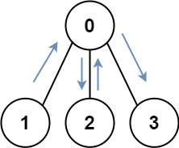
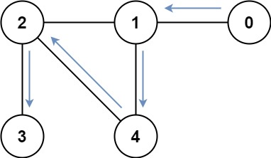

## 847. Shortest Path Visiting All Nodes

(enunciado)

[Link para a questão](https://leetcode.com/problems/shortest-path-visiting-all-nodes/)

### Gravação

#### Dificuldade: Difícil

### Enunciado

You have an undirected, connected graph of n nodes labeled from 0 to n - 1. You are given an array graph where graph[i] is a list of all the nodes connected with node i by an edge.

Return the length of the shortest path that visits every node. You may start and stop at any node, you may revisit nodes multiple times, and you may reuse edges.

Example 1:

Input: graph = [[1,2,3],[0],[0],[0]] 
Output: 4 
Explanation: One possible path is [1,0,2,0,3]

Example 2:

Input: graph = [[1],[0,2,4],[1,3,4],[2],[1,2]] 
Output: 4 
Explanation: One possible path is [0,1,4,2,3]

Constraints:

    n == graph.length
    1 <= n <= 12
    0 <= graph[i].length < n
    graph[i] does not contain i.
    If graph[a] contains b, then graph[b] contains a.
    The input graph is always connected.

### Submissões: 

