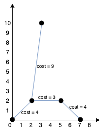

## 1584. Min Cost to Connect All Points

[Link para a questão](https://leetcode.com/problems/min-cost-to-connect-all-points)

### Gravação
[Link para gravação](https://www.youtube.com/watch?v=AWvqtp4Oiro)

#### Dificuldade: Média

### Enunciado

You are given an array points representing integer coordinates of some points on a 2D-plane, where points[i] = [xi, yi].

The cost of connecting two points [xi, yi] and [xj, yj] is the manhattan distance between them: |xi - xj| + |yi - yj|, where |val| denotes the absolute value of val.

Return the minimum cost to make all points connected. All points are connected if there is exactly one simple path between any two points.

Example 1:

Input: points = [[0,0],[2,2],[3,10],[5,2],[7,0]] 
Output: 20 
Explanation: 

We can connect the points as shown above to get the minimum cost of 20. 
Notice that there is a unique path between every pair of points.

Example 2:

Input: points = [[3,12],[-2,5],[-4,1]]
Output: 18

Constraints:

    1 <= points.length <= 1000
    -106 <= xi, yi <= 106
    All pairs (xi, yi) are distinct.

### Submissões: 

